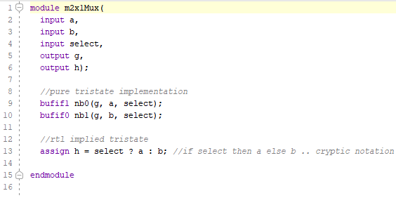
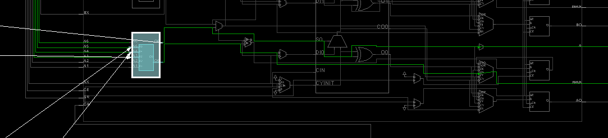
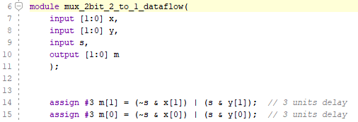
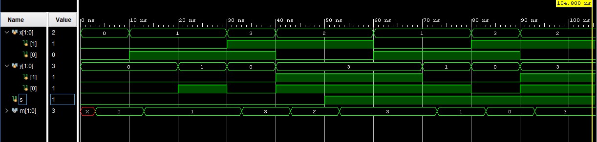
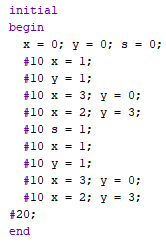

# Mux
[Inspiration for this lab](https://www.xilinx.com/support/documentation/university/Vivado-Teaching/HDL-Design/2015x/Verilog/docs-pdf/lab1.pdf)

Vivado turns all circuits into the primitives of a CLB Slice: LUTs, muxes, carry-logic, xor gates, d flip flops. Understanding these is the goal of this course. We have covered XOR gates and LUTs. The goal now is to cover muxes. 

## 1_1_m2x1Mux-1bitwide

#### Port Diagram

#### 

#### Verilog Code

#### RTL Schematic Screen shot

#### Synthesis Schematic Screen shot

#### Implementation Device screen shot zoomed in on something interesting

#### Testing

SW[0] is x, SW[1] is y, SW[2] is the select line and LED[0] is the output m. SW[2] selects SW[0] or SW[1] and connects it to the LED. 

#### **Questions**/Tasks

*In the rtl schematic screen shot, the two **and gates** are connected to select and not select. Describe what they are doing in terms of what a mux does.*

Answer: The select and not select are the data lines from which we provide data to the mux, we can change the data feeding into the mux by using those input lines.

*In the rtl schematic screen shot, what does the **or gate** do in terms of what a mux does?*

Answer: The two AND gates in the MUX feed  to the OR gates before showing the output as lighting up the LED.

*How does the schematic change after running synthesis?*

Answer: The schematic changes from having 3 cells and 6 nets before synthesis to 5 cells and 8 nets, and turns it into a 3 NOT gates feeding into a LUT which outputs into a NOT gate before the output.

*After running synthesis and implementation, clicking on synthesis under RTL, synthesis and Implementation continues to display the LUT based diagram. Not the gate based diagram. Why? Form a reasonable, non-trivial, relevant hypothesis.* 

Answer: After running the synthesis and implementation the LUT based diagram is displayed and not the gate based diagram as now going back will have several possibilities of the gate based diagram as the LUT based diagram is the summarized version of several possible gate based diagrams.

 *The black and white design window appears first after running which step of the workflow?*

Answer: The black and white design window appears after running the synthesis and implementation and zooming into the device leaf cells.

*How what can you click on to see a region of the device window change from some color to white?*

Answer: You have to open the design under the leaf cell tab and click and drag to see a region of the device.

*White arrows in the screen shot above are helping us see what?* 

Answer: The white arrows in the above diagram are showing the inputs and the outputs.

*How does Data flow in the fpga from left to right, right to left, bottom up, top down?*

Answer:  The data flow in the fpga left to right using the inputs that are fed and 

*What is the verilog symbol for the white line going up at an angle in the device diagram?*

Answer: I think here the question is asked about the cursor to draw white lines, which I believed was automatically selected when I opened device diagram.

## lab1_1_mux2-1-2bitwide

#### Port Diagram

#### Verilog Code

#### RTL Schematic Screen shot

#### Synthesis Schematic Screen shot

#### Implementation Device screen shot zoomed in on something interesting

#### Testing

One select line now selects between two pair of inputs and displays one of the pairs on LEDs. 

#### Questions/Tasks

*Explain how to zoom in on the above Device Screen Shot.*

Answer: Ctrl+Equals

*Do you see pictures of muxes in the Device Screen Shot? Are they used?*

Answer: The picture of muxes in the Device screenshot are visible clearly, the inputs that are being used are shown by white lines.

*Which stage of the work flow choose the specific LUT above?*

Answer: The above stage popped up on screen after running implementation and synthesis before doing bitstream.

*Which stage of the work flow chooses the green lines?*

Answer: The above question design lines opened after running implementation and I  believe since I didn't open it after running synthesis it didn't show me any change.

*What do the white lines represent?* 

Answer: The white lines represent the active lines in the mux representing input, output and select.

*What do the spots where white lines cross represent?*

Answer: They may represent multiple inputs or outputs splits.

## lab1_2_mux2-1-tristate

### Port Diagram

#### Verilog Code

#### RTL Schematic Screen shot

#### Synthesis Schematic Screen shot

#### Implementation Device screen shot zoomed in on something interesting

#### Testing

Two muxes are implemented using the same inputs with the same select line.  So if the two are equal, their outputs should be equal.  SW[0]- a , SW[1]-b,  SW[2]-select, outputs are the first two LEDs. 

#### Questions/Tasks

*In the RTL schematic, what is RTL_Mux g1_i doing?*

Answer: It is acting as select line for the RTL_Muxh1_i.

*Which of the two verilog implemented muxes actually created a tristate symbol in the RTL schematic?*

Answer: The inputs a and b and output from mux g1.

*After Synthesis, which of the two verilog implemented muxes looks more simple?*

Answer: I believe that h1 gets more simpler as it has less components than g1 post synthesis.

*After Synthesis, why hasn't Vivado detected that the two circuits are identical?*

Answer: The vivado shows a simplified version after the synthesis therefore it is supposed to be identical but simpler.

*After implementation, does the schematic change? If so, put a screen shot here.*

Answer: 

*Do the insides of the device reflect the schematic .. after implementation?*

Answer: The insides represent the similar schematic as synthesis.

*What are the truth tables of the one or two LUT(s)? Put a screen shot(s) here.*

Answer:

*Are the truth tables the same or different? Why would Vivado do this? Is this a bug in Vivado?*

Answer: The truth tables are different and this is because its not a bug but the truth table shows how the leds in the circuit behave differently.

*Do some tests modifying this project. Can you make the one line of code mux into a 4 input, 2 select line, 1 output mux in one line?*

Answer: I tried modifying it into a 4input, 2line and 1 output in just one line however I ran into trouble when I tried differentiating the input from output and select as it didn't recognize them as different things.

## lab1_2_tb_mux2-1-2bitwide

The screen shots and port diagrams above are not going to be done for you. For the rest of the semester, you are to supply the missing diagrams. For example, starting with the RTL screenshot, everything through testing is missing. Describe how to test this circuit. **Crop the screen shots**!

### Port Diagram

#### 

#### Verilog Code

#### Simulation Screen Shot

#### RTL Schematic Screen shot

#### Synthesis Schematic Screen shot

#### Implementation Device screen shot zoomed in on something interesting

#### Testing

#### Questions/Tasks

*tb stands for what?*

Answer:  Test bench

*What verilog code is the top level module, the test or the circuit?*

Answer: The top code is showing a test with clocks and other test bench features.

*The verilog code shares the same port interface as the previous 2bit wide circuit. How is the verilog code different?*

Answer:  This is different as it is working with 4 leds and the previous 2 bit wide was working with 2 leds only.

*What name would you give to this verilog abstraction level?*

Answer:  I would say testing level or maybe more detailed level.

*In the simulation, what is the cause of the red box with an X in it above?* 

Answer:  That's the register signal as they are default set to x.

*In the simulation, what do the green boxes with numbers in them mean?*

Answer: The numbers show the clock and the intervals in between them.

*In the simulation, was all the activity captured or are their changes to the left of the yellow vertical line?*

Answer: I believe that not all activity was captured as the changes are represented to the left of yellow line but more changes can be seen if the range is increased.

*Is this simulation associated with RTL, Synthesis or Implementation Vivado analysis?*

Answer:  This simulation is associated with RTL implementation in Vivado analysis.

*Is this a physics simulation or logic simulation?*

Answer: This is a logic simulation.

*Can the previous, port-interface identical, circuit be simulated without test verilog code?*

Answer: I believe yes it can be simulated using a different way other than verilog code.

*If it can be, take a screenshot of the Simulation and compare with this one.*

Answer:  

*If it can't be simulated, take a screenshot of the error message and form a hypothesis of what it is trying to tell you in your own words.*

Answer: 

**Look at this line of code**. It has a module name and then () with nothing in them. 

*Where does the test get it's input?* 

Answer:  The inputs are shown in the above screen shot.

*Where does it's output go?*

Answer: The outputs are shown after the input line ending.

**The next questions** are about this line of code: 

*Which circuit above has the same format of three instructions separated by a space?* 

Answer: I was not able to figure this answer.

*Does the first section refer to the circuit or the test it's self?*

Answer: The first section refers to the circuit.

*DUT stands for Device Under Test. Can this name be changed?*

Answer: It can be changed to LUT or UUT. 

*What were some of the names used instead of DUT in the circuit above?*

Answer: LUT/UUT/DUT

*What is the purpose of it?* 

Answer: The purpose is to say that it can be implemented using the same code.

**The .x(x) format** is different than the circuit above when calling a module. [Suppose this article](http://verilog.renerta.com/mobile/source/vrg00027.htm) is the first you find that describes what is going on. 

*What are the keywords you searched for to find a better article?* 

Answer: Vivado integration format/ Vivado input format/ Vivado language for LUT, DUT and UUT.

*What is it's URL?* 

Answer: https://www.xilinx.com/support/documentation/sw_manuals/xilinx2014_1/ug903-vivado-using-constraints.pdf

*Is this technique limited to test verilog code or can it be synthesized?* 

Answer: The technique I think it is not limited to verilog code and it can be synthesized but not in all cases.

**The following questions are about this code block:**

*Is the word "end" the end of the "begin" or the end of initial?*

Answer: In the above cropped screen shot, it will act as both as there is no code visible after the end statement therefore it will represent both begin end and initial end.

*Why isn't there a semi-colon after "end"?*

Answer: The semi colon is not necessary to show the ending after writing end as it is a keyword in verilog.

*Are the commands under begin executed sequentially or in parallel?*

Answer: They should not run sequentially as they are running in parallel because of no order.

*Are all the possible combinations of x, y and s tested?* 

Answer: I don't think that all are tested as it would be 3x3x2 = 18 possibilities.

*How many combinations of x,y and s are there?*

Answer:  9

*Is there a reason that the #20; is intended?*

Answer: That's something I don't understand, maybe to show the end of running statements.

*Does white space matter in verilog?*

Answer: I don't think the white space matters in verilog.

**Read these articles** ... about using initial: [argument](https://forums.xilinx.com/t5/Design-Methodologies-and/quot-initial-quot-statement-with-quot-output-quot-variables/td-p/485782), [pro](http://billauer.co.il/blog/2018/02/verilog-initial-xst-quartus-vivado/), [con](https://www.quora.com/Why-are-initial-blocks-synthesizable-in-FPGA-and-not-in-ASIC), . 

*Which article article supplies the most evidence?*

Answer:  The argument article.

*Which article is merely opinion?*

Answer: The con and to some extent pro is merely an opinion.

*Which merely says it is possible?*

Answer: The con one says that it is possible. 

*What concept is the initial concept linked up to ... that we haven't discussed?* 

Answer: The setting up and how to write verilog code from different languages.

*Make up a rule for yourself regarding using verilog initial command now. You can change in the future. What is this rule?*

Answer: The rule is to understand the inputs and outputs and understand the meaning that why is it being implemented and predict outcomes. That will prepare my mind to look at the code and reach a conclusion easily.

**Bigger Picture**

Here are some answered questions that you may have.
*Are there ways to write a verilog test that creates messages such as "pass" or "fail"?* **Yes**
*Are there ways to create verilog loops in the test that cycle through all x,y and s combinations?* **Yes**
Is writing a test in verilog different than creating a circuit in verilog? **Yes**
Are verilog commands used to create tests not synthesized by vendors? **Yes**

Now answer these questions:

*Do you want to learn how to write verilog to test this stuff, or something like java, c++ or python to test?*

Definitely Yes!

**Even Bigger Picture**

4 Does the above test actually test with the Vivado implemented FPGA physics or merely test the Verilog logic?* **Verilog Logic.** 
*2 Does Vivado try to communicate physics or logic to you through "Open Synthesized Design", "Open Implemented Design"?* **Physics**
*3 Is there a way to build a circuit to test a circuit and put them both in an FPGA?* **Yes**
*1 Is there a way to collect data about a circuit in FPGA RAM and then dump it to a PC to test?* **Yes .. Is built into Vivado called ILA (integrated logic analyzer)**

*Please rank the above questions by putting a number in front of the with 1 being what you would like to learn first, and 4 being what you would like to learn last .. given that we are working with small circuits.*

*Which of the test methods is more appropriate for a very large project like a CPU?*

Answer: I believe the last one.

## lab1_3_mux2-1-1bitwide-reg

### Port Diagram

#### Verilog Code

#### RTL Schematic Screen shot

#### Synthesis Schematic Screen shot

#### Implementation Device screen shot zoomed in on something interesting

#### Testing

#### Questions/Tasks

*This circuit is similar to which previous circuit?* 

Answer: It is similar to tb mux 2 1 2 bitwide.

The @* is the clearest indication of verilog evolution and the difference between system verilog and regular verilog. Here is a summary. Later we will read the [Cliff Cummings, SunBurst paper](http://www.sunburst-design.com/papers/CummingsSNUG2016SV_SVLogicProcs.pdf) paper on this topic. 

​	always @(y,x) .. too many mistakes, hard to read code ..
​	always @(\*) .. any variable on the right hand side of an equal sign
​	always @\* ..  since 2001 .. just forget the parenthesizes

*Why is there so much verilog code using old forms of the always command on the internet?*

The always @* can not reference a clock. There is no clock in our circuit. It is combinational logic.  One can tell it is combinational logic by looking at the = sign in the begin/end code.  This means that it is executed in sequence .. at near the speed of light. 

*reg stands for what?*

Answer: Registers.

*What is m driven by in the previous similar circuit?*

Answer: The m is driven by the outputs.

*What is a reg m driven by in this circuit .. when just looking at the verilog code?*

Answer: The m is driven by the select lines and outputs.

*How is the RTL Schematic of this circuit different the pervious similar circuit?*

I wasn't able to implement the RTL Schematic if this circuit as my pc was getting timed out and getting stuck.

A reg typically uses a D-flip flop inside an FPGA slice. *Do you see any evidence in the schematic or in the device itself of the reg?*

Reg without a clock is called a latch. Vivado hates latches. It goes to extremes to eliminate latches.
Read through the Messages this circuit generates.  *Does any message say it is not creating a reg?*

This verilog code is described by Vivado tutorials as at the behavioral abstraction level (..a good thing.. above RTL abstraction level). *What is good about it since the reg was essentially ignored?*

*Given that RTL programming involves reg, is it a requirement that RTL verilog coding cause the use of an FPGA CLB's D-flip flop?*

*Which verilog code is more "C" like, this code or the previous similar circuit?* *Why?*

This mux can be [implemented with one line of code](https://github.com/ENES-246DigitalElectronics/ENES246/blob/master/-5MuxOfMux/m2x1Mux/m2x1Mux.srcs/sources_1/new/m2x1mux.v):  assign m = s ? x : y; 
*Why isn't this talked about above? Why isn't this given the name RTL verilog or Behavioral verilog?*

It isn't talked about because its too direct and makes it difficult to observe  change and behavior.

## lab1_3_mux2-1-2bitwide-reg

The simple mux circuits explored in this lab were created with various forms of the if then else command above. The single line of code is **if else** short hand. But it can not grow larger muxes. But what does a larger mux mean? There are two answers to that question explored below. 

### Port Diagram 

#### Verilog Code

#### RTL Schematic Screen shot

#### Synthesis Schematic Screen shot

#### Implementation Device screen shot zoomed in on something interesting

#### Testing

#### Questions/Tasks

*How is this code different from the previous project?*

Circuits get large several ways. One way is doing many things in parallel.  Parallel is like herding cattle .. the goal being a couple of horses and dogs guiding cattle. Here in select line is guiding the path of 2 cows. *Re-write this code to guide 64 cows.* 

Another [single line of code that synthesizes](https://github.com/ENES-246DigitalElectronics/ENES246/tree/master/-5MuxOfMux/m16x4MuxRTL) a mux is:  assign m = i[s]; 
where i[0]=x and i[1]=y. This scales from having 2 inputs on two wires and 1 select line one wire, to 32 inputs with 5 select lines ... a bigger mux rather than multiple copies of the same mux. *How many select lines would be needed to choose one of 128 cows?* 

*Begin [reading this document](https://web.stanford.edu/class/archive/ee/ee371/ee371.1066/tools/verilog_tips.pdf) and then answer this question .. Is it worth trying to create a design tool that can create multiple copies and grow larger at the same time?* 

Answer the previous question from the big picture point of view, not from the (is it possible) point of view.  A mux is an old digital design concept. RTL is a new concept. Behavior modeling with verilog **if else** and **reg** is very similar to C. When learning to programming, was learning a mux a pre-requisite? **No.**  *Is it worth learning about a mux?* 

*What is the largest mux that would fit in a 6 input LUT?*

In the Implementation Device screen, there are pictures of a mux. *Why does vivado implement **if else** in a LUT when it has muxes in the configuration logic blocks (CLB)?* 

[Fast Carry Logic](https://www.xilinx.com/support/documentation/user_guides/ug474_7Series_CLB.pdf) speeds up any math the FPGA does. On page 42 there is this diagram: 

*When does vivado implement the CLB muxes?*

Answer: I think vivado implements CLB muxes when LUT consists of a flip flop and multiplexer making it more complicated version of LUT.

*Is fast carry logic a control path or data path concept?* 

Answer: Fast carry logic is a data path concept.

## lab1_4_2-mux2-1inSequence

One of the ways we know what is going on is to predict Vivado's behavior. This circuit uses two select lines, but only selects between 3 inputs. Normally two select lines chooses between four inputs. So this is not quite a mux. 

### Port Diagram

#### Verilog Code

#### RTL Schematic Screen shot

#### Synthesis Schematic Screen shot

#### Implementation Device screen shot zoomed in on something interesting

#### Testing

#### Questions/Tasks

*Which of the two modules above is the top level module?*

*What is the symbol for top level module in the vivado design sources hierarchy?*

*Which of the two modules above has nets (wires) mentioned in the XDC file?*

What are the lower level module instantiation names? 

*What in the XDC file is the wire ul_o connected to?*

Do an experiment.  Change the .x, .y, .z and .m order in the instantiation. *Does the code still produce the same RTL schematic?*

Do another experiment. Remove .x, .y, .s and .m along with the parentheses () in the module instantiation, **but keep the original order that matches the instantiated module**.  *Does this code still produce the same RTL schematic?*

Think about a big project. You start off writing the smaller modules and testing. Then you write larger and larger modules. The larger modules call the smaller modules. Two very different larger modules may re-use the same smaller module.  Port Interface drawings keep track of the net names, but not the order defined in the lower module. Mapping higher module net names to lower module net names means having to know what order they were originally in .. in the lower module.  *Which of the above net mapping techniques between modules makes it only necessary to map wire names, not order?*

*Does the RTL schematic show the two instantiated modules?* 

*What does the Plus sign mean?*

How does the synthesized schematic change? 

*How many LUTs does the synthesized schematic indicate will be used?*

*After implementation, does the schematic change?*

The LUT has 5 inputs and a truth table of all their possible combinations.  *Where is this truth table in the Vivado interface (hint: netlist)?*

*Take a screenshot of the truth table and put it here.*

*Find where I4, I3, .. I0 are mapped to the top level input nets. Put the screen shot here.*

*Is there any order to the mapping?*

 

## Ethics

These ethics questions are related to the community of engineers working for industry, working for Xilinx, and working to teach about this subject.  Together they have to create standards.  Verilog is called a standard by the IEEE.

*Describe the success of the verilog standard.*

*Do you think the IEEE, the largest, international, engineering standards organization, lays down law that Engineers world wide have to follow?* 

*Are engineers involved with precise, universally known best practice that hasn't changed for over 100 years or are technicians?* 

*Why are there all these different ways of implementing a mux in verilog when vivado turns them all into the same thing .. a LUT?* 

*If there is one good, true way of implementing a mux in verilog, why not just teach/learn that?*

*Given the chaos of the verilog standard, does this excite you as an engineer with visions of an opportunity?  Does it give you visions of a job reducing the chaos, unexplored cracks where there are possible significant improvements in productivity, possible unknown territory that the standard hasn't addressed? Or does it depress you?*

*What does chaos feel like?*

*Describe the tremendous advantages a fresh young mind has when confronted with chaos.* 

*Having learned about a chaos, visualize the advantages one has when confronted with one of these opportunities:  .. getting a doctorate, working for Xilinx or using Xilinx tools in a competitive engineering company.* 

*Given that Fortran hasn't changed since the 1960's, C hasn't changed since the 1970's. Java and C++ haven't changed for [decades](https://www.tiobe.com/tiobe-index/), do these languages excite you as an engineer or depress you?*

Almost all software today has verilog code generators including matlab, python, Lab View. A lot of this code will pass Simulation on [EDAplayground](https://www.edaplayground.com/) or will only work with specific hardware.  *What are the chances that generated code will work in Vivado?* 

*How universal is the digital design process, how universal are the design documents and the symbols they contain that are entered into and looked at in matlab, python and LabView?*

*What is the market share of [Xilinx](https://www.fool.com/investing/2018/04/17/xilinxs-project-everest-looks-like-bad-news-for-in.aspx)?* 